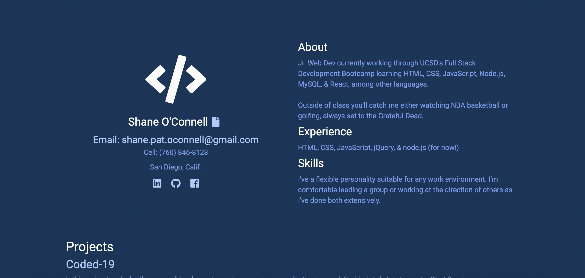

# SPO Port-fo-lio Assignment
## Shane O'Connell
### Original: 12-8-2020
### Update #1: 1-6-2020
### Project Status: Complete
### https://shaneocon.github.io/welcome-to-my-portfolio/index.html
## Description

My portfolio is a minimalist approach to reflect the beginnings of my career as a developer.  I know that with time, my page will grow and change to incorporate far more than it currently displays. 

## Solution
    I began by pulling the starter code from Bootstrap and it was off to the races.  Me being the tortoise, of course.  
    
    Coding with Bootstrap was challenging for me because I couldn't quite seem to grasp the grid styling but I do feel more comfortable now than I did before starting this assignment.   

## Usage 

This website can be used to attract potential clients as well as job recruiters.  It will detail professional projects while also granting a window into a bit of my personal bio.  

## Bootstrap Features
##### Grid Styling
##### Hover Buttons on front page
##### Repsonsive Design

# Summary

(as of 12-8-2020) It's not a pretty website, but it will get the job done for my first attempt at a multi-pager from scratch.  

I really enjoyed this assignment because it pushed me to use Google more than I had previously thought possible. And what do you know? I was able to find 90% of the answers and implement them into my application.  

However, I still have lingering questions regarding the Bootstrap Grid system and will have to address those with the instructor soon.  But I feel like I'm starting to grasp more and more each day and that is a good feeling for someone who, when it comes to web development, is the definition of "green behind the ears."

